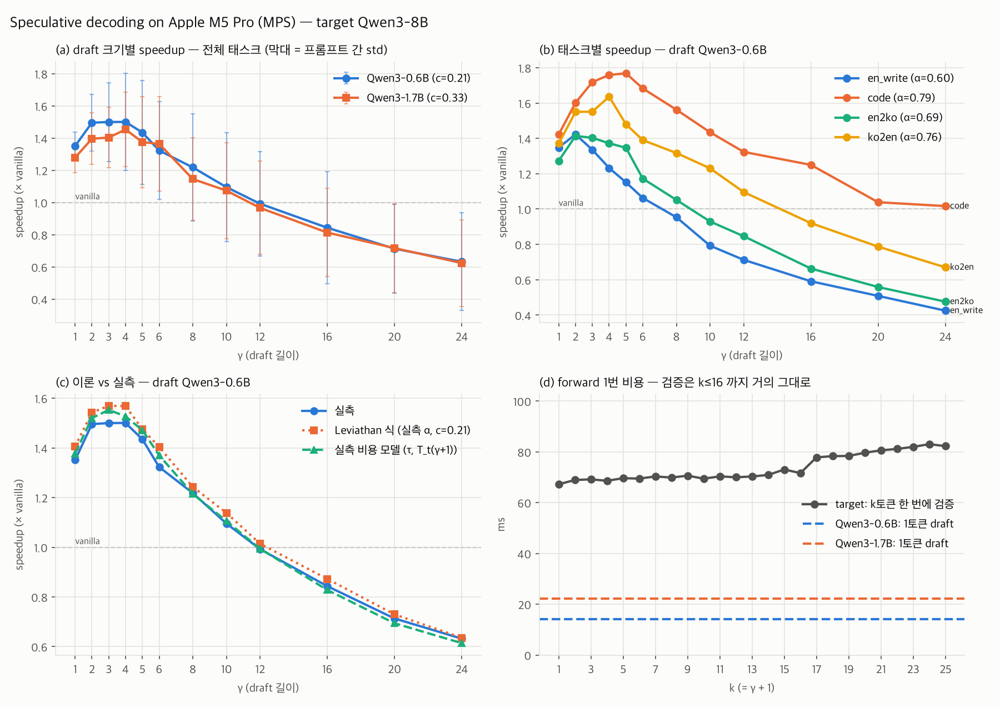

# 온디바이스AI-3팀 · Speculative Decoding

몰입심화학습(On-Device AI) 자유주제 연구 · ENC Lab · 박준하 · 박지호 · 양동균

**연구 주제** — 한국어 번역 task에서 speculative decoding의 acceptance rate와 latency가 draft-target 조합과 하드웨어 조건에 따라 어떻게 달라지는지 측정하고, 그 차이를 draft의 어휘 커버리지와 분포 정렬로 설명한다.

## 폴더

| 경로 | 내용 |
|---|---|
| [`spec-decode/`](spec-decode/) | Leviathan(ICML 2023) speculative decoding 직접 구현 + 속도 측정 코드, 실험 결과 |
| [`docs/W02-research-log.md`](docs/W02-research-log.md) | Week 02 연구 로그 (GitHub에서 바로 읽기) |
| [W02 연구 로그 웹페이지](https://junapark831.github.io/ondevice-ai-team3-specdecode/W02-research-log.html) | 같은 내용의 HTML 버전 (`docs/W02-research-log.html`) |

## 지금까지 결과 (W02, Apple M5 Pro 노트북)

Qwen3-8B target + Qwen3-0.6B / 1.7B draft, greedy, batch 1, 12프롬프트(en_write · code · en→ko · ko→en) × 2회.

| draft | c = T_draft / T_target | α | 최고 speedup | 역전 (speedup < 1) |
|---|---|---|---|---|
| Qwen3-0.6B | 0.21 | 0.69 | 1.50× (γ=4) | γ≈12 |
| Qwen3-1.7B | 0.33 | 0.79 | 1.45× (γ=4) | γ≈12 |

- 검증(target이 k토큰을 한 번에)은 k≤16까지 +9% 이내 → 역전을 만드는 건 draft 비용 γ·c
- c가 가중치 크기 비율의 2배: forward 1번 ≈ 7.8 ms 고정 오버헤드 + 바이트 / 259 GB/s
- 실측 α·c를 넣은 Leviathan 식이 역전 위치를 맞춘다 (모든 γ에서 실측과 0.01~0.08 차이)
- en→ko α(0.69)는 ko→en(0.76)보다 낮지만 영어 자유작문(0.60)보다 높다 — 원문 내용·토큰 길이 통제 전

자세한 수치는 [`spec-decode/results/combined/summary.md`](spec-decode/results/combined/summary.md), 해석과 경쟁 설명은 [W02 연구 로그](docs/W02-research-log.md).

## 재현

[`spec-decode/README.md`](spec-decode/README.md) 참고. 모델 가중치(약 20GB)와 가상환경은 저장소에 없다.
