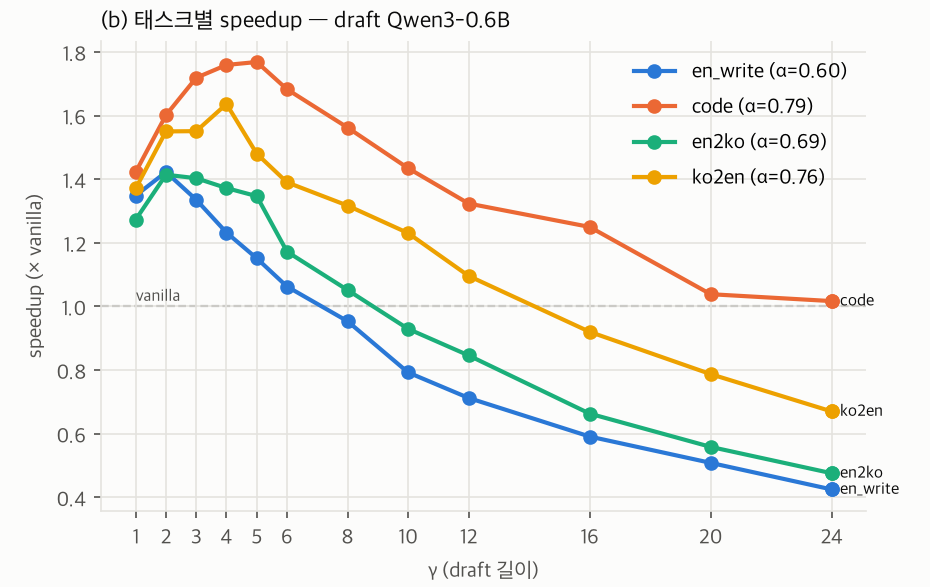
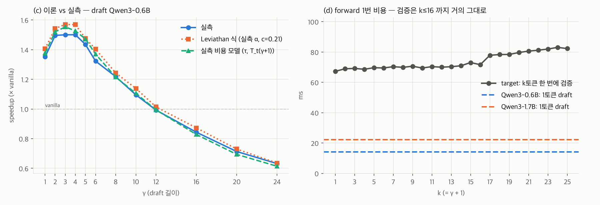

# Week 02 · 2026-10-02

ENC Lab · [온디바이스AI-3팀] 연구 로그 · 작성: 박준하

## 현황판 갱신

| ID | 가설 (한 줄) | 상태 | 최근 갱신 |
|---|---|---|---|
| H1 | 같은 동양권인 일본어, 중국어에서는 acceptance rate가 크게 떨어지며 그 감소폭은 draft-target 어휘 커버리지로 예측되고 연산 제약이 강해질수록 증폭되는데 한국어에서도 발생할 것이다. (변경 없음) | 설계 중 | W01 |
| H2 | 노트북(M5 Pro)에서 SD 역전 γ는 실측 α·c를 넣은 Leviathan 식 예측과 γ 격자 한 칸 이내로 일치한다. | **검증 중** | W02 |

## 한 줄 요약

Leviathan speculative decoding을 직접 구현해 노트북(Apple M5 Pro, MPS)에서 Qwen3-8B target + Qwen3-0.6B/1.7B draft로 γ를 1~24까지 sweep했다. **γ=4에서 최고 1.50×, γ≈12부터 vanilla보다 느려지고**, 이 역전 위치를 실측 α·c를 넣은 Leviathan 식이 맞췄다. 한국어 출력(en→ko)의 α는 영어 번역 출력보다 낮았지만 영어 자유작문보다는 높았다.

---

## H1. 한국어에서도 일본어·중국어처럼 α가 크게 떨어지고, 감소폭은 어휘 커버리지로 예측된다 (박준하)

**상태** — 설계 중, 변화 없음. 이번 주 측정은 커버리지 부분에 닿지 않는다(같은 토크나이저 쌍).

### 경쟁 설명

- **C1.** en→ko α가 ko→en보다 낮은 게 언어가 아니라 원문 내용 차이 때문 → **미실시.** 두 방향 프롬프트가 서로 다른 기사다.
- **C2.** 한국어 토큰이 잘게 쪼개져서(출력 1.57 글자/토큰 vs 영어 4.5~5.8) 생긴 차이 → **미실시.** 토큰당 글자·바이트는 기록해 둠.
- **C3.** 언어가 아니라 출력의 자유도가 α를 정한다 → **배제 실패.** 영어 자유작문(0.60)이 한국어 번역(0.69)보다 낮다.

### 이번 주

Qwen3-8B target, γ=4, 태스크당 프롬프트 3개 × 2회, greedy, 최대 128토큰. 진 조건부터.

| 태스크 | α · 0.6B draft | α · 1.7B draft | 역전 γ (0.6B / 1.7B) |
|---|---:|---:|---:|
| en_write | 0.60 | 0.71 | 8 / 8 |
| en→ko | 0.69 | 0.80 | 10 / 12 |
| ko→en | 0.76 | 0.85 | 16 / 16 |
| code | 0.79 | 0.89 | 24 초과 / 24 |

en→ko는 ko→en보다 α가 0.05~0.07 낮고 더 일찍 역전된다(γ 10·12 vs 16). 하지만 4개 태스크 중 최저는 아니다.

### Figure

태스크별 speedup (draft 0.6B). 한국어 출력(초록)이 영어 번역(노랑)보다 먼저 1 아래로 내려가지만 영어 자유작문(파랑)보다는 늦다.

### 해석

"한국어라서 α가 낮다"는 이 데이터로는 말할 수 없다. 같은 영어 출력끼리도 자유작문과 번역이 0.14~0.16 차이 나서, 언어 차이(0.05~0.07)보다 태스크 차이가 크다.

H1을 검증하려면 (1) 같은 내용의 병렬 문장으로 방향만 바꾸고 (2) 어휘가 다른 draft-target 쌍을 써서 커버리지를 변수로 만들어야 한다. 지금 쌍(Qwen3 계열)은 커버리지 100%라 H1의 핵심 변수가 고정돼 있다.

### 미보고

커버리지 — 같은 토크나이저라 측정 불가(H1의 핵심 단어). 일본어·중국어 미측정. "연산 제약이 강해질수록 증폭" 미측정. 태스크당 프롬프트 3개라 0.05~0.07 차이가 프롬프트 간 산포보다 큰지 모른다.

### 논문 매핑

보류

---

## H2. 노트북(M5 Pro)에서 SD가 vanilla보다 느려지는 γ는, 실측 α와 draft 비용비 c를 넣은 Leviathan 식 예측과 γ 격자 한 칸 이내로 일치한다 (박준하)

**상태** — 신규 → 검증 중

### 경쟁 설명

- **C1.** 다른 프로세스 부하가 speedup을 바꿨다 → **배제.** 측정 중 같은 맥의 다른 작업으로 vanilla가 14.8 → 6.3 tok/s로 떨어진 구간을 발견해 분리하고([`runs_rep1_contaminated.csv`](../spec-decode/results/main/runs_rep1_contaminated.csv)), 프롬프트마다 vanilla를 앞뒤로 재는 드리프트 검사(10% 초과 시 제외, 12블록 중 2개 제외)를 넣어 재측정. 회차 간 차이 평균 0.02, 최대 0.07.
- **C2.** 이론-실측 일치가 집계 방식 때문 → **확인 후 수정.** α·τ를 전체 합산해 식에 넣으면 큰 γ에서 예측이 0.1 낮았다(τ 낮은 프롬프트에 가중). run별 예측 후 평균으로 고침.
- **C3.** 이 하드웨어·소프트웨어 스택에서만 맞는 것 → **미실시.** 3090 필요.

### 이번 주

12프롬프트(4태스크 × 3) × 2회, γ 1~12 (2회차는 24까지), bf16, batch 1. ±는 프롬프트 간 std(대부분 태스크 차이). 진 조건부터 — 1.7B는 α가 0.1 높은데도 최고 speedup이 0.6B보다 낮다.

| draft | c | α | 최고 speedup | γ=12 | 역전 γ (실측 / 비용모델 / Leviathan) |
|---|---:|---:|---:|---:|---:|
| Qwen3-1.7B | 0.33 | 0.79 | 1.45 ± 0.23 (γ=4) | 0.97 | 12 / 16 / 16 |
| Qwen3-0.6B | 0.21 | 0.69 | 1.50 ± 0.30 (γ=4) | 0.99 | 12 / 12 / 16 |

target 1토큰 67 ms. 검증(k토큰 한 번에)은 k≤16까지 +9% 이내, k=17에서 +16%로 계단. 전체 수치는 [`summary.md`](../spec-decode/results/combined/summary.md).

### Figure

왼쪽: 검증 비용까지 넣은 모델이 모든 γ에서 실측과 ±0.05, Leviathan 식은 0.01~0.08 높게 본다. 오른쪽: 검증은 거의 공짜이고 역전을 만드는 건 draft 비용 γ·c다.

### 해석

역전은 "얻는 토큰 τ는 γ=6 이후 3.0~3.3으로 포화, 비용 γ·c+1은 선형"이 만나는 γ≈12다.

핵심은 c가 가중치 크기 비율(0.09)의 2배라는 점이다. 세 모델 1토큰 비용이 **7.8 ms + 가중치 바이트 / 259 GB/s**로 맞아떨어지고, 0.6B forward의 55%가 크기와 무관한 고정 오버헤드다. 그래서 이 노트북에선 α를 올리는 것(1.7B)보다 draft 비용을 줄이는 쪽이 이득이 크다.

오버헤드가 없으면(c=0.09) 같은 α에서 최고 ~2.0×, 역전 γ≈24로 예측된다. 하드웨어별 적용 bound를 c 하나로 옮길 수 있다는 뜻이고, 3090에서 이 예측이 맞는지가 다음 검증이다.

### 미보고

c만 바꾼 통제 실험 없음(오버헤드 제거, 다른 HW) — "예측된다"를 다른 c에서 아직 보이지 못했다. greedy 출력이 vanilla와 77%만 같다(bf16 동점 뒤집힘으로 확인했지만 fp32 비교 안 함). temperature>0 속도 미측정.

### 논문 매핑

Leviathan (ICML 2023) 속도 식 재현 / Fig. 후보 — 하드웨어별 역전 γ

---

## 미팅 결정사항

*미팅 중 pod leader가 직접 입력.*

## 선행연구 · 막힌 것

- 3090 사용 일정 — H2 C3과 하드웨어 비교가 여기 걸려 있다.
- H1용: en↔ko 병렬 코퍼스 추천, 어휘가 다른 draft-target 쌍(Timor 2025 방식)을 범위에 넣어도 되는지.
- Qwen3-8B용 EAGLE-3 drafter 공개 여부 아직 미확인.
